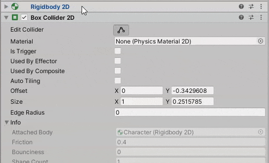
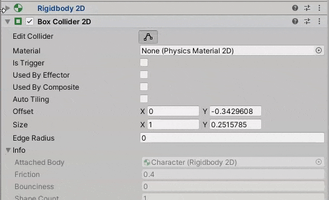
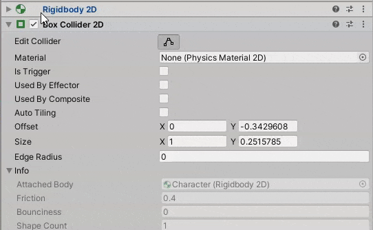

# 8 Directions Movement

### Requirements

To have a functional character you will need a **GameObject** the following components:

* **SpriteRenderer**: to render the sprite of the character.
* **RigidBody2D**: it will allow the **GameObject** to have velocity and receive forces (like jump or dash).
* **BoxCollider**: this part is only needed with your character needs to collide with other objects.

* **Script**: a custom script, in this case named EightDirMovement

### In Unity

##### Prevent character from falling

To prevent the character to fall through the scene you will need to do one of the following changes in the **RigidBody2D** component inside the **Inspector**.

| Change the **Body Type** from `Dynamic` to `Kinematic` | Change the **Gravity Scale** to 0         |
| ------------------------------------------------------ | ----------------------------------------- |
|             |  |

##### Prevent character from spinning

Another useful thing to do is to prevent rotation in the Z-axis. When using collision between objects your character may start to spin, if you don't want this, then check the `Z checkbox` in the **Freeze Rotation** on the **Constraints** section of the **RigidBody2D** component.



### In Visual Studio

Edit the C# script EightDirMovement and make it look like this one. The comments are the explanation of the code.

```c#
using System.Collections;
using System.Collections.Generic;
using UnityEngine;

public class Character : MonoBehaviour
{
    // A RigidBody2D variable to store a reference to the component in our GameObject.
    Rigidbody2D rb;
    // A Vector2 variable to store the player input.
    Vector2 playerInput;
    // A variable to store the move speed of the character. If you want to customize this on Unity, add [SerializeField] to the beginning of the line
    float moveSpeed = 500f;
    
    // The Start method is called before the first frame
    void Start()
    {
        /*
         * Now we get the reference to the RigidBody2D component and store in the rb variable.
         * 
         * !IMPORTANT -> The GetComponent function should not be called in the Update or FixedUpdate methods,
         * to prevent the logic from being executed multiple times without need.
         * And if you need to access a component more than once, you should store the value in a variable.
         * 
         * More information at: https://docs.unity3d.com/ScriptReference/GameObject.GetComponent.html
         */
        rb = GetComponent<Rigidbody2D>();
    }

    // The Update method is called once per frame
    void Update()
    {
        /*
         * The Input.GetAxis method get the player input in the specified axis. The axis are handled by Unity and
         * by default are named Horizonal and Vertical. Another possible method to use is Input.GetAxisRaw, using
         * this will prevent Unity from smoothing the player input, use this accordingly to your project.
         * 
         * More information at: https://docs.unity3d.com/ScriptReference/Input.GetAxis.html
         */
        playerInput.x = Input.GetAxis("Horizontal");
        playerInput.y = Input.GetAxis("Vertical");
    }

    // The FixedUpdate method is called in fixed intervals
    private void FixedUpdate()
    {
        /*
         * Here we set the velocity of the RigidBody2D using the playerInput which is a Vector2 containing values from 0 to 1
         * representing the player input.
         * We multiply it by the moveSpeed.
         * And then multiply by the Time.fixedDeltaTime property, that represents how much time has passed since the last FixedUpdate call.
         * This last part is very important to prevent unwanted behaviour, using this, doesn't matter if the
         * FixedUpdate method is called 5 or 20 times, the player velocity will always behaviour at the same way.
         */
        rb.velocity = playerInput * moveSpeed * Time.fixedDeltaTime;
    }
}

```

